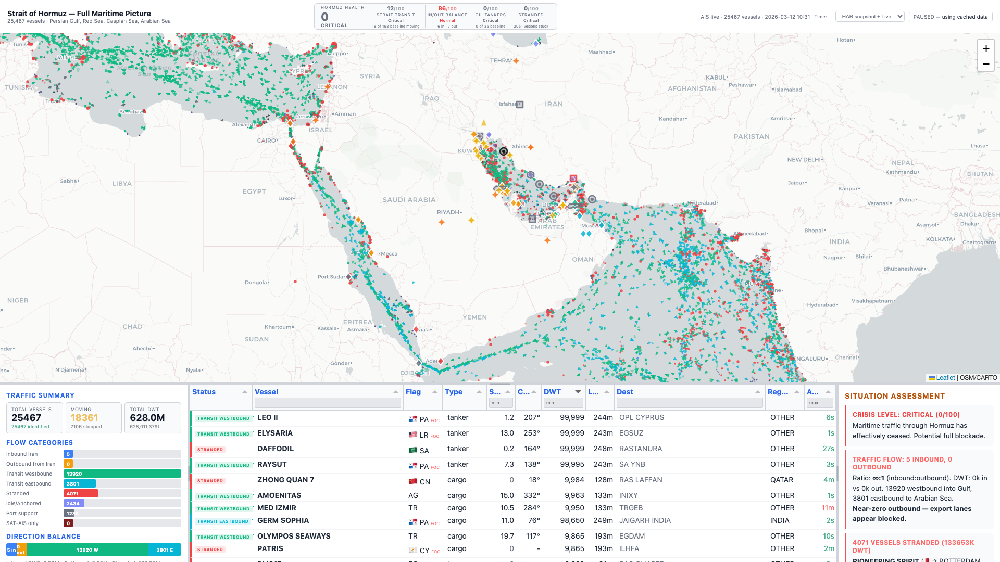

# Hormuz Crisis Intelligence Platform



Real-time maritime intelligence dashboard for the 2026 Strait of Hormuz crisis. Tracks shipping flow disruption, supply chain impacts, conflict events, and infrastructure damage across the Persian Gulf, Red Sea, and Caspian Sea.

## Crisis Score: 0/100 CRITICAL

As of March 12, 2026:
- **Zero tankers transiting** the Strait of Hormuz
- **2,061 vessels stranded** (81M DWT)
- Oil: 87% disrupted (only bypass pipelines flowing)
- LNG: 99% disrupted (Qatar production halted)
- Fertilizer: 7 days to critical shortage
- Gulf food imports: 10 days to critical

## Features

### Maritime Intelligence
- **25,000+ vessel positions** from MarineTraffic AIS data
- Directional triangle markers for moving ships, circles for stationary
- Ship classification: inbound/outbound Iran, transit, stranded, idle, dark/SAT-AIS
- Ship type silhouette icons in popups (tanker, cargo, tug, passenger, fishing)
- Click ship to see line to destination port

### Crisis Scoring
- **Overall crisis score** (0-100) with NORMAL/ELEVATED/HIGH/SEVERE/CRITICAL levels
- Transit score, flow balance, tanker traffic, stranded vessel analysis
- Supply chain impact with days-to-critical countdowns (TSMC, fertilizer, Gulf food, LNG)
- Auto-refreshes every 60 seconds

### Conflict Event Mapping
- 77+ geolocated incidents from liveuamap.com, iranwarlive.com, Wikipedia
- Explosion burst markers for strikes, triangles for military sightings
- News aggregation from BBC, Al Jazeera, Reddit OSINT communities
- Color by recency (red = recent, fading to gray)

### Infrastructure Tracking
- 25 critical facilities (oil terminals, refineries, gas terminals, pipelines)
- Status: operational/degraded/damaged/destroyed with color coding
- Kharg Island (DESTROYED), Bandar Abbas refinery (DAMAGED), ADNOC Ruwais (DAMAGED)
- Bypass pipelines: Habshan-Fujairah, East-West Petroline

### Port Network
- 32 ports across Persian Gulf, Red Sea, Caspian Sea
- Click port to see lines to all ships headed there (headed vs stranded)
- Suez Canal, Jeddah, Yanbu, Aden, Djibouti, Baku, Aktau and more

### UI
- Dark/light mode (inherits system preference)
- Resizable map and panels
- Tabulator table with sort, filter, group-by, viewport sync
- Canvas-rendered markers for 25K+ ship performance

## Quick Start

```bash
pnpm install
pnpm dev          # Vite dev server on :5173
```

## Refresh Data

```bash
node server/collect.js          # Run all adapters + regenerate scores
node adapters/reddit.js          # Reddit OSINT (5 subreddits)
node adapters/news-rss.js        # BBC + Al Jazeera RSS
node adapters/liveuamap.js       # Conflict events
node scoring/score.js            # Crisis score
node scoring/supply-chain.js     # Supply chain impact
```

## Data Sources

| Source | Adapter | Events |
|-|-|-|
| MarineTraffic HAR | scripts/extract-har.cjs | 25,467 ships |
| liveuamap.com | adapters/liveuamap.js | 46 conflict events |
| iranwarlive.com | adapters/iranwarlive.js | 16 theater events |
| Reddit OSINT | adapters/reddit.js | 33 posts (5 subreddits) |
| BBC + Al Jazeera | adapters/news-rss.js | 52 articles |
| Wikipedia | adapters/wikipedia-events.js | 29 timeline events |
| AISStream.io | scripts/collect-ais-extended.cjs | Live AIS (optional) |

## Architecture

```
src/                    # Vite ES modules (frontend)
  main.js               # App entry point
  map.js                # Leaflet + custom canvas markers
  ships.js              # Ship classification + parsing
  table.js              # Tabulator setup
  ports.js              # Port network + ship-port linking
  infrastructure.js     # Critical facility layer
  incidents.js          # Conflict event overlay
  crisis-widget.js      # Header crisis score display
  analysis.js           # Data-driven situation assessment
  ...
adapters/               # Data collection adapters
scoring/                # Crisis score + supply chain impact
server/                 # Data aggregation
data/                   # JSON data files
research/               # Architecture docs + source analysis
```

## Research

- `research/architecture.md` — Full platform architecture plan (793 lines)
- `research/supply-chain-impacts.md` — Commodity flow analysis
- `research/conflict-events-sources.md` — OSINT source catalog
- `research/military-osint-sources.md` — Military tracking methods
- `research/hormuz-monitor-analysis.md` — Competitor analysis

## Tests

```bash
pnpm test               # 234 tests across 8 files
```

## License

MIT
